# 🔐 Secure Access Control System using LPC2148 ARM7

---

# ⭐ Overview

A highly secure **Embedded Access Control System** developed using the **LPC2148 ARM7 Microcontroller** implementing **Three-Level Authentication**.

Unlike conventional password systems, this project verifies

- 👤 User ID
- 🔑 Password
- 👆 Fingerprint

before unlocking the door.

The system stores passwords securely inside an **AT24C256 EEPROM** while fingerprint templates are maintained in the **R305 sensor flash memory**.

# 📷 Complete System Architecture

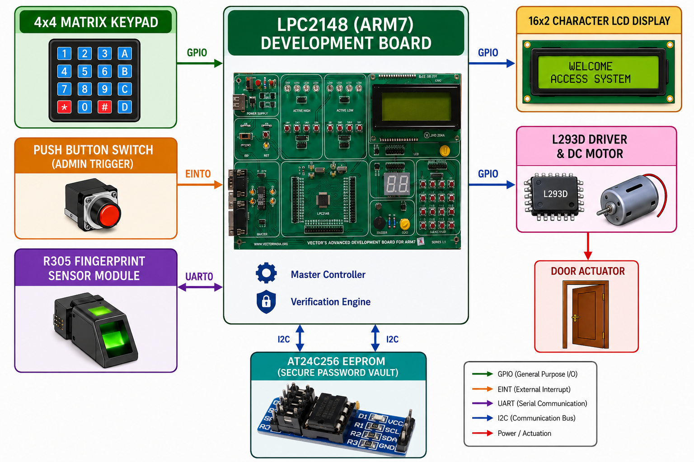

---

# 🎯 Project Objectives

- Prevent unauthorized entry
- Provide Multi-Level Authentication
- Secure Password Storage
- Biometric Authentication
- Automatic Door Lock
- Password Modification
- Fingerprint Enrollment
- Fingerprint Deletion
- Interrupt Based Admin Menu

---

# 🧩 Hardware Components

| Component | Purpose |
|------------|---------|
| LPC2148 ARM7 | Main Controller |
| R305 Fingerprint Sensor | Biometric Authentication |
| AT24C256 EEPROM | Password Storage |
| L293D Driver | Motor Driver |
| DC Motor | Door Lock |
| 16x2 LCD | User Interface |
| 4x4 Matrix Keypad | User Input |
| Push Button | Admin Interrupt |

---

# 🖥 System Block Diagram

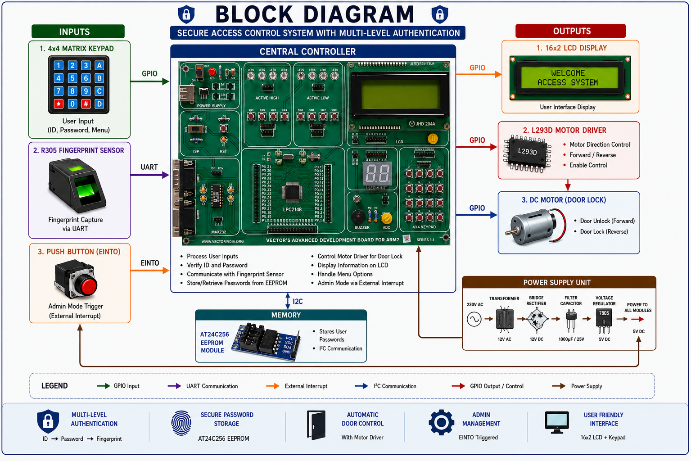

---

# 🔐 Authentication Flow

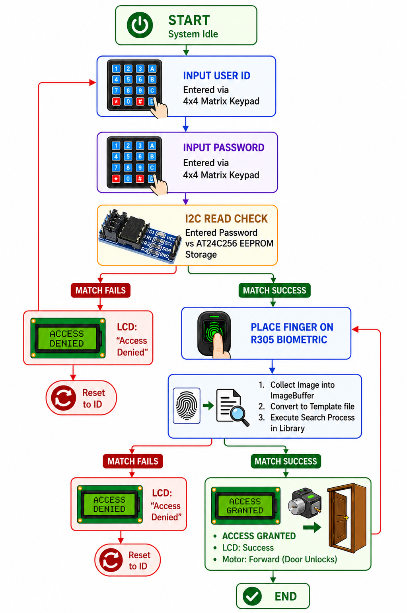

---

# 🔑 Admin Mode (External Interrupt)

Admin Mode is triggered through **EINT0**.

Once activated, administrator can

- Change Password
- Enroll Fingerprint
- Delete Fingerprint

---

# 🛠 Admin Flow

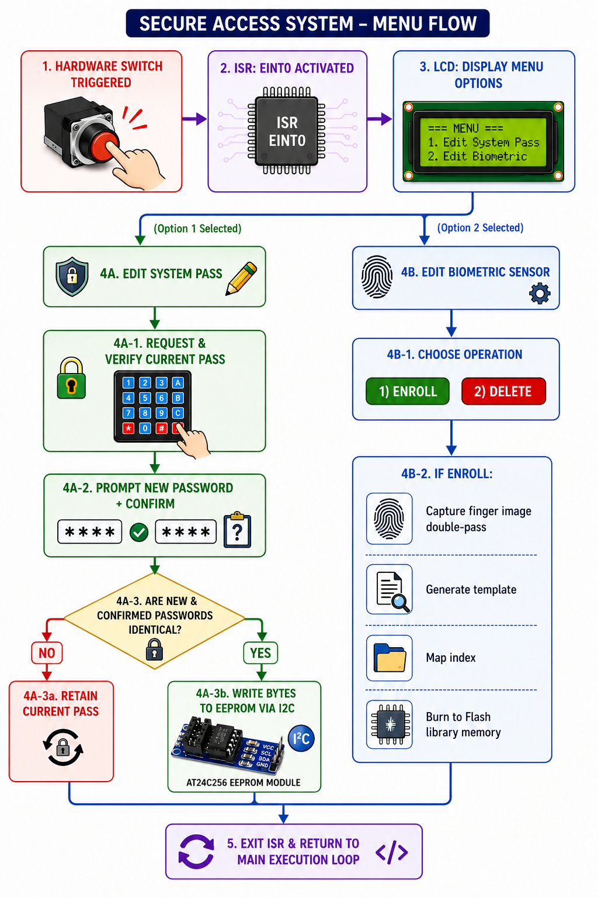

---

## Password Update Process

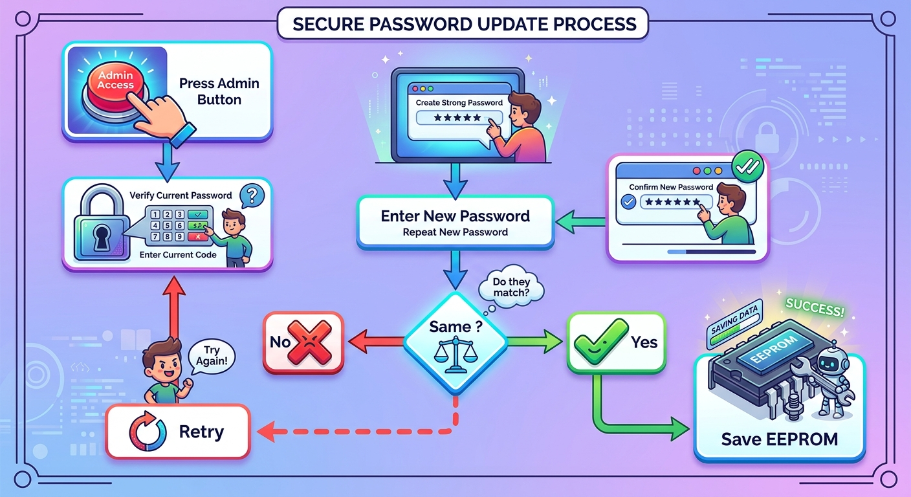

---

## Fingerprint Enrollment

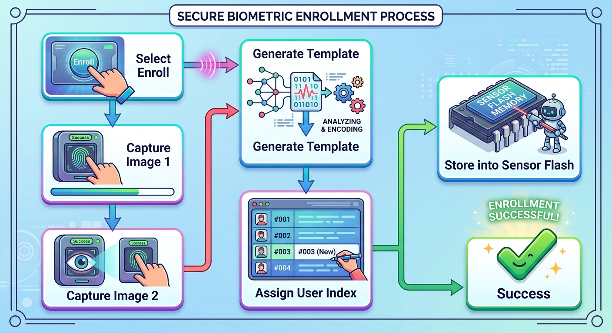

---

## Fingerprint Delete

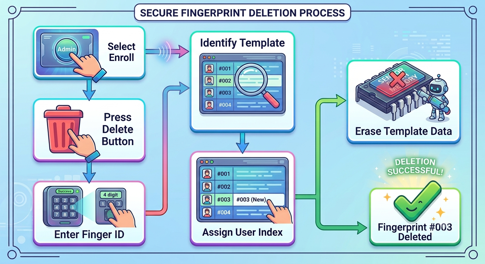

---

# 💾 Memory Allocation

| Memory | Usage |
|----------|---------|
| RAM | User Input |
| Flash | Program |
| EEPROM | Password |
| Sensor Flash | Fingerprints |

---

# 🔧 Communication Protocols

| Device | Protocol |
|----------|------------|
| EEPROM | I2C |
| Fingerprint | UART |
| LCD | GPIO |
| Keypad | GPIO |
| Motor Driver | GPIO |

---

# 🔒 Security Layers

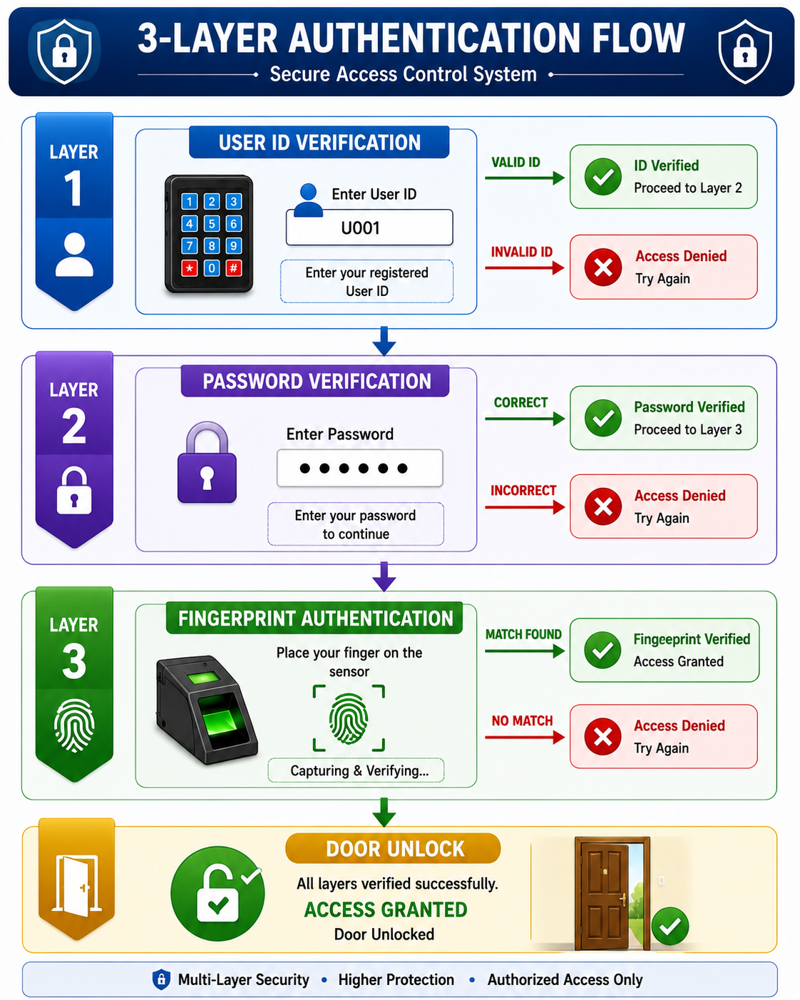

---
# 🚀 Features

- Multi-Level Authentication
- Fingerprint Authentication
- Password Protection
- EEPROM Storage
- Interrupt Driven Admin Mode
- Fingerprint Enrollment
- Fingerprint Delete
- Automatic Door Control
- LCD Interface
- Embedded C Firmware
- ARM7 Based Security

---

# 📸 Project Gallery

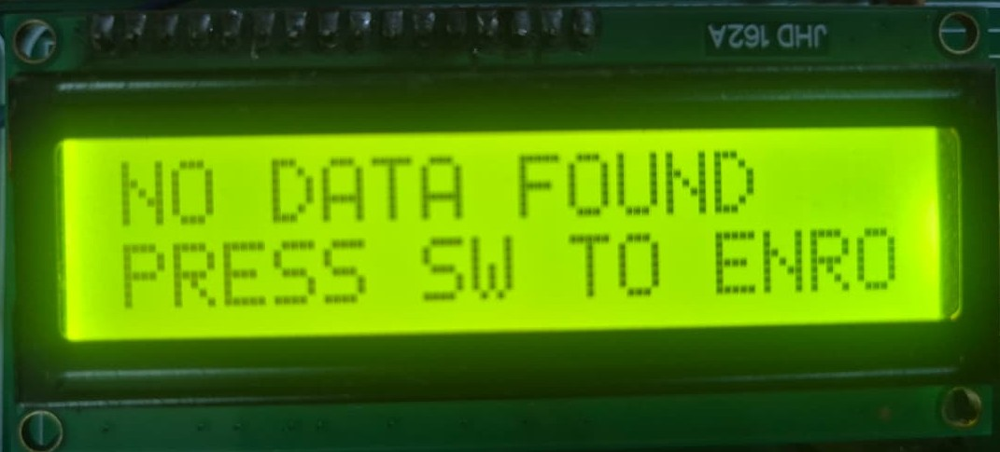 | 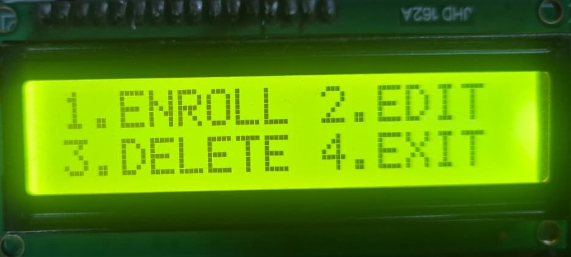 |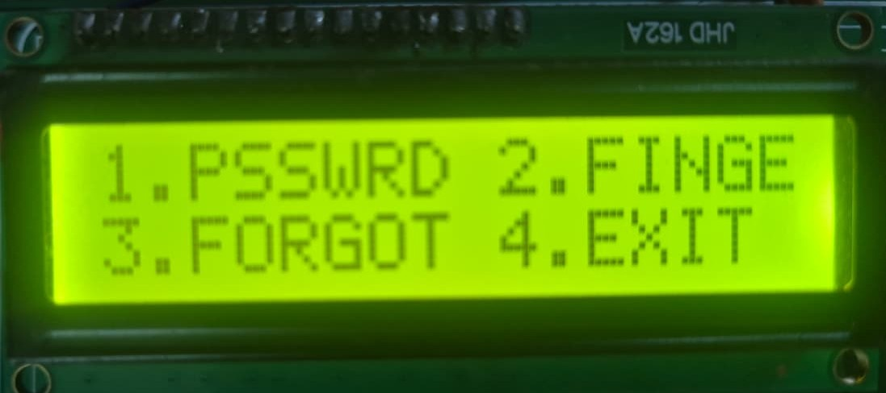 | 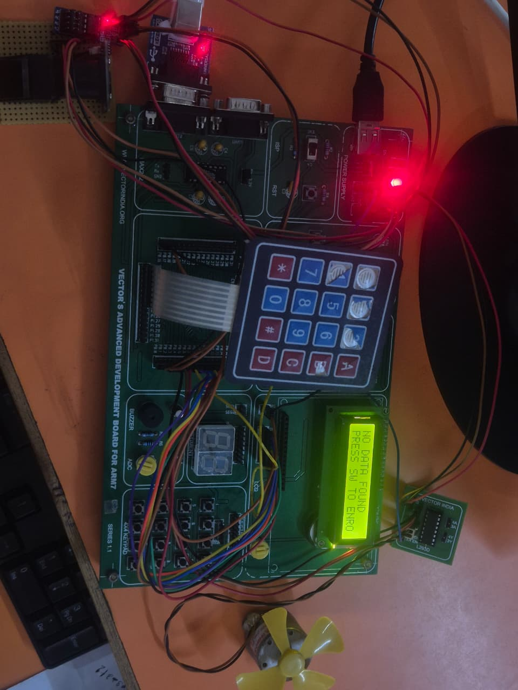 | 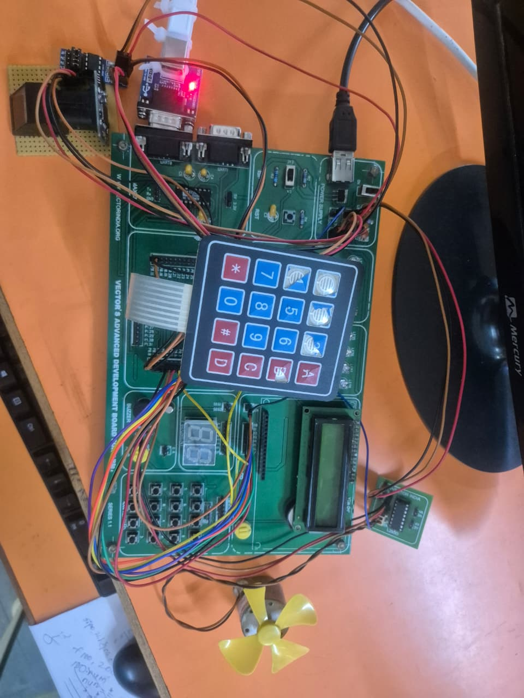

---
---

# 💻 Software Used

- Embedded C
- Keil μVision
- Flash Magic

---

# 🔌 Hardware Used

- LPC2148
- R305
- AT24C256
- LCD
- L293D
- DC Motor
- Matrix Keypad
- Push Button

---

# 👨‍💻 Author

**Palakurla Shirisha Goud**

Bachelor of Technology (Information Technology)

Embedded Systems Engineer

2025 Graduate

---

# 📜 License

This project is intended for educational and academic purposes.

Feel free to fork, modify and improve the project.

---

# Thank You..
